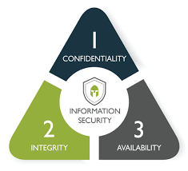

## Three Objectives of Cyber Security 

  

- Confidentiality 
- Availability
- Integrity 

Also known as the **CIA Triad** 

**Confidentiality** ensures unauthorized individuals are not able to gain access to sensitive information. 

**Integrity** ensures there are no unauthorized modifications to information or systems.

**Availability** ensures that information and systems are ready for use by legitimate users upon request. 

### Three main threats to cybersecurity (DAD Triad)
- Disclosure 
- Alteration 
- Denial 

